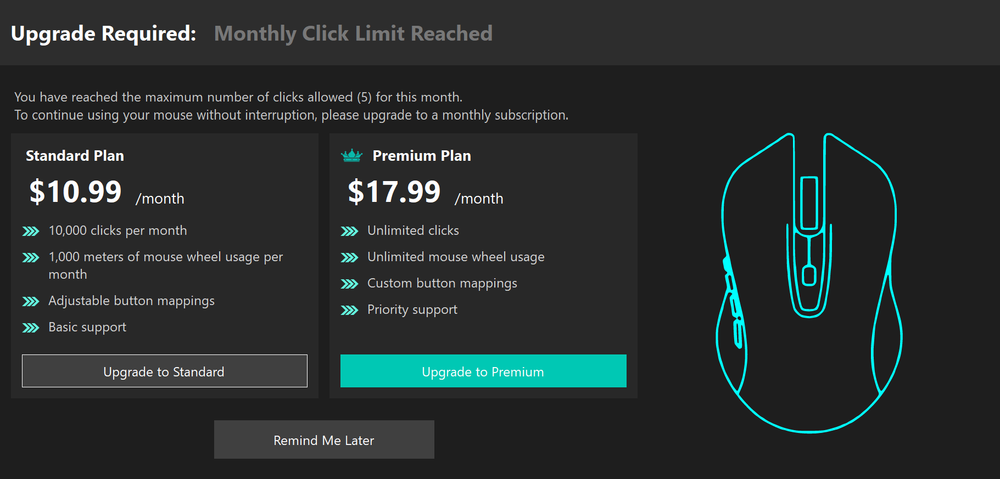

<h1 align="center">ClickGuardian</h1>
<h2 align="center">Because Clicking Shouldn't Be Free</h2>

Are you tired of unlimited, reckless clicking? Do you believe in a more structured, subscription-based approach to using your own mouse? Look no further! ClickGuardian is here to revolutionize the way you interact with your PC.

### 🚀 Key Features:
✅ **Click Regulation** – Never overuse your mouse again! Our Standard Plan grants you a generous **10,000 clicks per month**.

✅ **Mouse Wheel Management** – We monitor and limit your scrolling to a liberal **1,000 meters per month**.

✅ **Subscription Plans** – Need more clicks? Upgrade to our Premium Plan for **unlimited** clicks!

✅ **User-Friendly Interface** – A sleek UX pop-up to remind you when you've reached your limit.

✅ **Exclusive Perks** – Premium members get priority support and custom button mapping!

### 💳 Pricing Plans:
- [x] **Standard Plan**: $10.99/month – 10,000 clicks, 1,000 meters of scrolling
- [x] **Premium Plan**: $17.99/month – Unlimited clicks & scrolling

Join the **movement** towards a more responsible, pay-as-you-click future!

---

 
 
 

# Wait, Wut?

Ok, actually. ClickGuardian is a prank program designed to troll your friends and colleagues by tacking their mouse clicks and displaying a paywall when they surpass a configured limit. It is 100% free.

ClickGuardian can:
- Register itself to run at startup
- Count mouse clicks globally, per month
- Present a paywall
- Block clicks past the configured limit

 

Under `config.json`, you can change these fields:
- `ClickLimit` - The amount of clicks to allow per month.
- `GracePeriod` - The amount of clicks to allow after clicking "Remind Me Later". It would be very mean to set this to 0.
- `UnlockTime` - The time in milliseconds to delay after clicking "Remind Me Later"
- `BlockClicks` - Whether to actually block using the mouse.
- `ShowTrayIcon` - Whether to show the application icon in the tray.
- `ShowExitButton` - Whether to show a nice "Exit" button on the tray icon. Requires `ShowTrayIcon`.
- `RegisterForReboot` - Whether to rerun itself at next reboot.

 
 
 

## Install
See [INSTALL.md](INSTALL.md) for installation instructions.

Just want to see what it looks like? Set the config to allow 5 clicks, run it, click 5 times.

**Warning:** Insert general disclaimer in legalese saying how I am not responsible for anything harmful done with this, etc.
